需求分析
--------

1.  数据字典（包括数据项、数据结构、数据流）

数据项、数据结构见4.1.系统关系模型4.2.系统数据库表结构

1.  数据流图

图 主要操作数据流图

概念结构设计
------------

图 E-R图

1.  逻辑结构设计

    1.  **系统关系模型**

        1.  用户表（*用户名*，密码，拥有文件数量，拥有文件夹数量，最大创建数量）

        2.  文件细节表（*文件ID*，文件名，文件所有者，文件类型，创建时间，是否加锁）

        3.  文件夹关系表（*文件ID*，子文件及文件夹ID队列，父文件夹ID）

        4.  文件内容表（*文件ID*，文件内容）

    2.  **系统数据库表结构**

数据库表索引

| 表名                | 中文名       |
|---------------------|--------------|
| User                | 用户表       |
| File_Detail         | 文件细节表   |
| Folder_Relationship | 文件夹关系表 |
| File_Inner          | 文件内容表   |

用户表(User)

| 字段名     | 字段类型 | 长度 | 主/外键 | 字段值约束 | 对应中文名   |
|------------|----------|------|---------|------------|--------------|
| name       | char     | 10   | P       | Not null   | 用户名       |
| passWord   | char     | 15   |         |            | 密码         |
| fileNum    | int      | 4    |         |            | 文件数量     |
| folderNum  | int      | 4    |         |            | 文件夹数量   |
| storageMAX | int      | 4    |         |            | 存储数量上限 |

文件细节表(File_Detail)

| 字段名         | 字段类型 | 长度 | 主/外键 | 字段值约束 | 对应中文名 |
|----------------|----------|------|---------|------------|------------|
| fileID         | int      | 5    | P       | Not null   | *文件ID*   |
| fileName       | char     | 15   |         |            | 文件名     |
| fileOwner      | char     | 10   |         |            | 文件所有者 |
| fileType       | tinyint  | 4    |         |            | 文件类型   |
| fileCreateTime | char     | 25   |         |            | 创建时间   |
| isLocked       | tinyint  | 1    |         |            | 是否加锁   |

文件夹关系表(Folder_Relationship)

| 字段名            | 字段类型 | 长度 | 主/外键 | 字段值约束 | 对应中文名           |
|-------------------|----------|------|---------|------------|----------------------|
| fileID            | int      | 5    | P       | Not null   | *文件ID*             |
| childrenFileIDArr | varchar  | 200  |         |            | 子文件及文件夹ID队列 |
| parentFolderID    | int      | 5    |         |            | 父文件夹ID           |

文件内容表(File_Inner)

| 字段名    | 字段类型 | 长度 | 主/外键 | 字段值约束 | 对应中文名 |
|-----------|----------|------|---------|------------|------------|
| fileID    | int      | 5    | P       | Not null   | *文件ID*   |
| fileInner | varchar  | 1024 |         |            | 文件内容   |

1.  **系统功能模块图和模块功能描述（模块IPO图）；**

图 系统功能模块图

1.  **安全性（用户类别和权限）和完整性（主、外码和用户自定义的完整性约束）设计；**

**安全性：**

图 数据库操作流程图

>   **操作规则：**

-   除管理员外，只能在自己拥有的目录中进行删除和新建文件夹，只能删除自己的文件和文件夹

-   文件默认是不锁定状态（欢迎文件默认锁定），所有人可读可写，文件夹默认不锁定，所有人可读，当加锁后，除了管理员，**其他人对加锁文件夹不能访问，加锁文件不能保存**，如果需要保护文件，可将文件放入文件夹加锁

**完整性：**

见4.1,4.2详细约束。

1.  **程序清单**

**/…**

**/css**

Style.css 界面样式管理文件

**/js**

Js.js 核心操作文件，数据结构的建立，数据操作等大部分功能在这里实现

**/i**

favicon.ico 网页的标签栏图标

login.png

login_w.png 登录界面和管理界面的LOGO

**/lib**

…(文件依赖，主要是AmazeUI的框架还有JQ文件)

Index.html 登录界面，从这里进入

FileSystem.html 文件系统界面

Server.php PHP接受AJAX请求页面，根据请求调用程序

Function.php PHP程序代码

File.sql MYSQL备份文件，用于建立数据库

系统测试方案和测试报告
----------------------

1.  初始界面

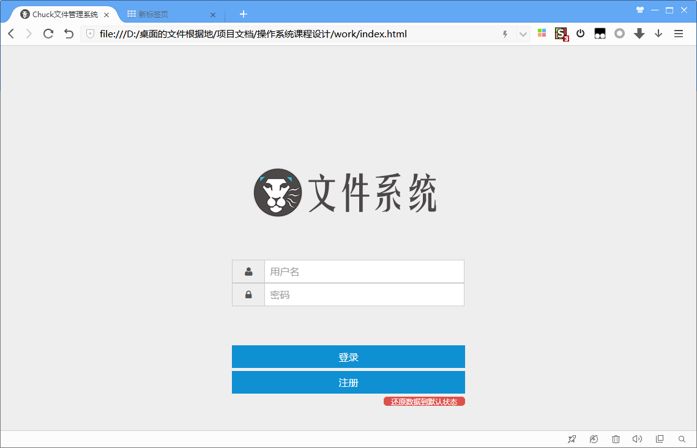

图7 初始界面

1.  注册

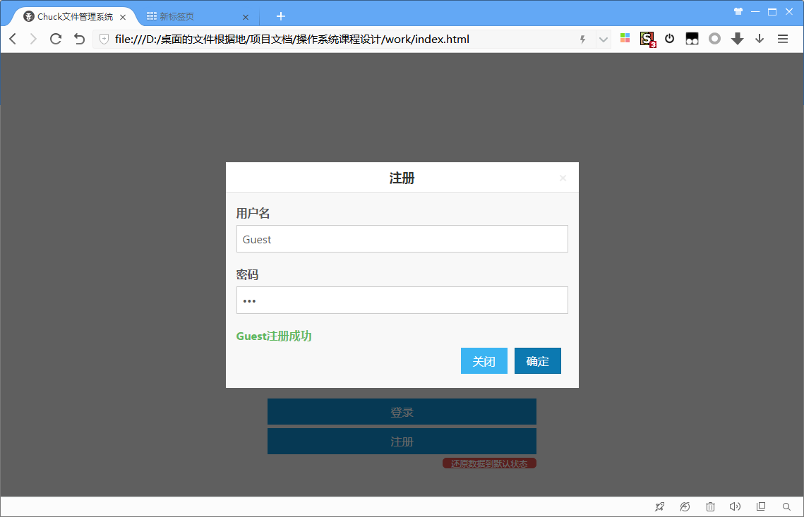

图8 注册界面

1.  登录

图9 登录界面

1.  新建文件

>   **（除了管理员，其他用户只有在自己的目录里才能对文件进行操作）**

图10 新建文件操作

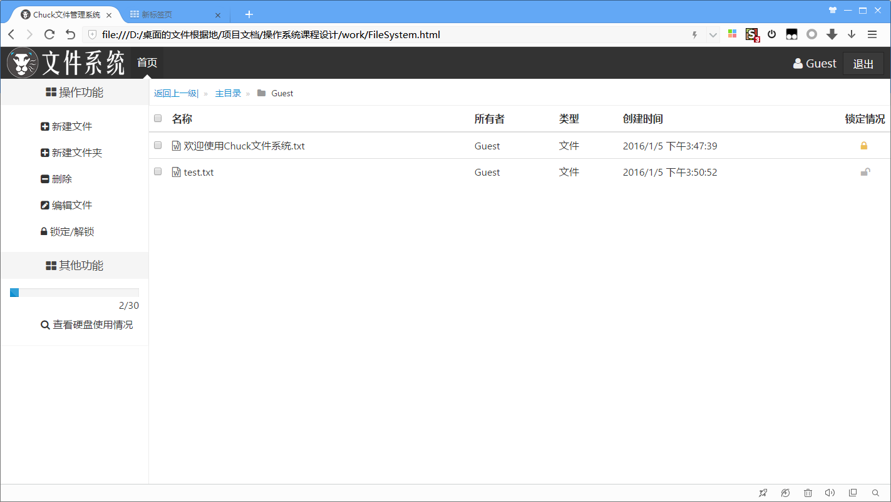

图11 新建文件操作结果

1.  新建文件夹

图12 新建文件夹操作

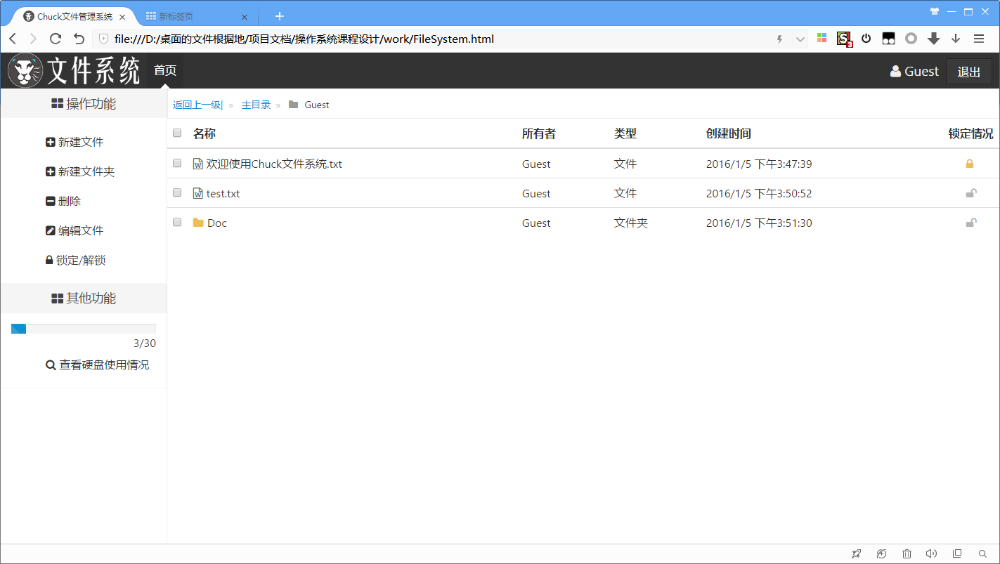

图13 新建文件夹操作结果

1.  删除文件

图14 删除文件操作

图15 删除文件操作结果

1.  删除文件夹

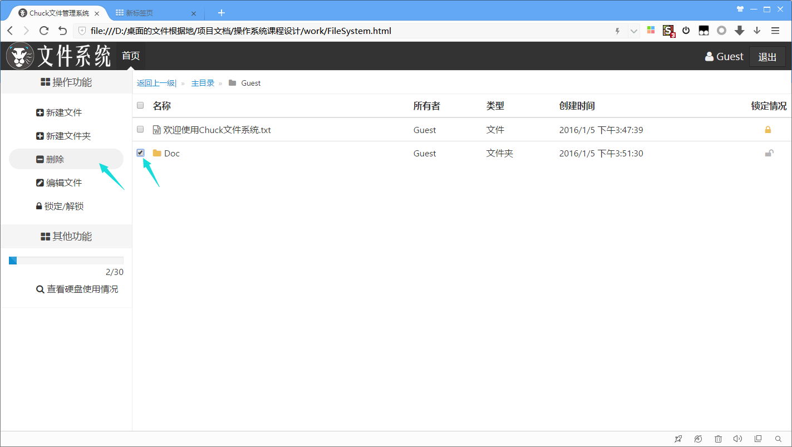

图16 删除文件夹操作-1

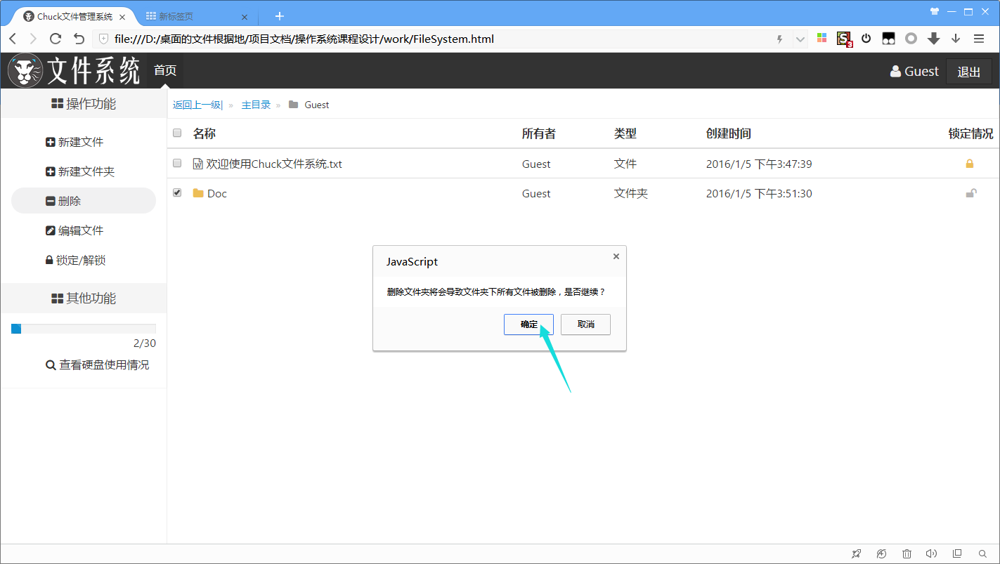

图17 删除文件夹操作-2

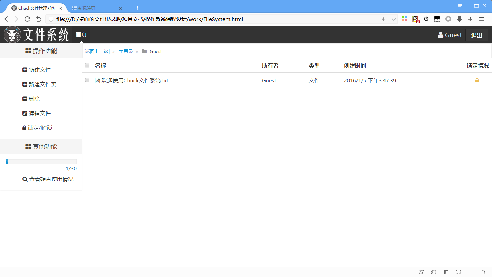

图18 删除文件夹结果

1.  批量删除文件和文件夹

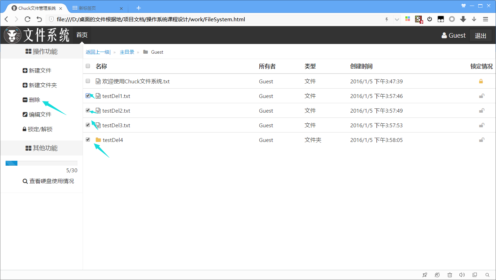

图19 批量删除操作-1

图20 批量删除操作-2

（删除到文件夹时会提示）

图21 批量删除结果

1.  面包屑导航

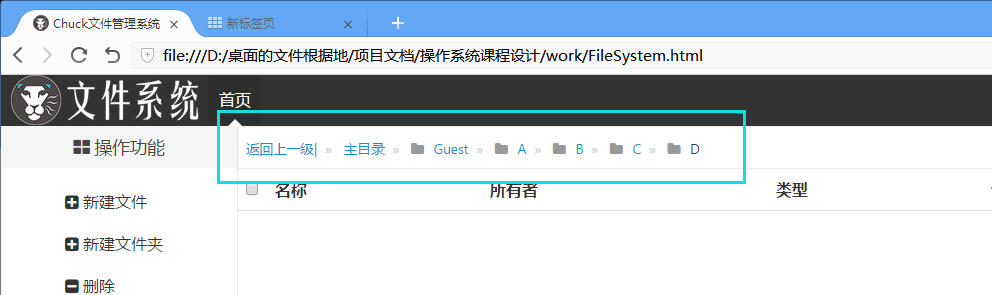

图22 面包屑导航界面

（点击其中的任意一级进入上级目录）

图23 面包屑导航操作-1

（点击返回上一级可以返回上一层文件夹）

图24 面包屑导航-2

1.  文件编辑

>   图25 文件编辑

1.  权限管理

>   **规则：**除管理员外，只能在自己拥有的目录中进行删除和新建文件夹，只能删除自己的文件和文件夹

图26 权限管理提示

1.  文件锁定\\解锁

**规则：**文件默认是不锁定状态（欢迎文件默认锁定），所有人可读可写，文件夹默认不锁定，所有人可读，当加锁后，除了管理员，**其他人对加锁文件夹不能访问，加锁文件不能保存**，如果需要保护文件，可将文件放入文件夹加锁

图27 文件未被锁定

（文件未加锁，任意修改）

图28 文件被锁定

（加锁文件不能保存）

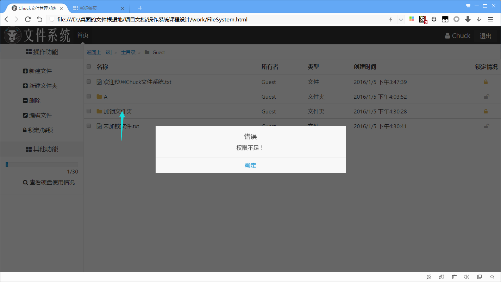

图29 文件夹被锁定

（加锁文件夹不能进入）

1.  查看个人磁盘使用情况

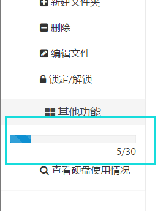

图30 个人磁盘使用情况

1.  查看总磁盘使用情况

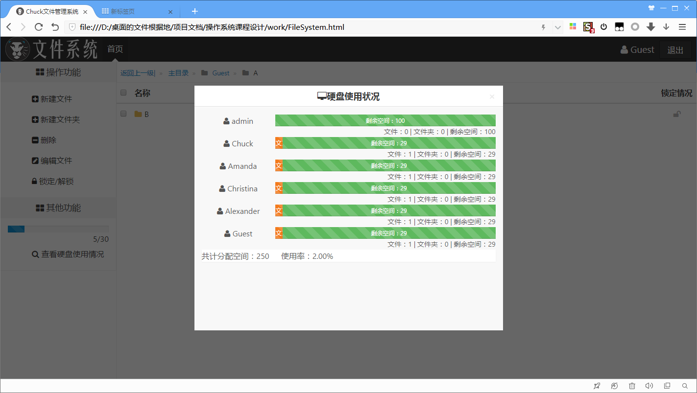

图31 查看总磁盘情况

1.  退出

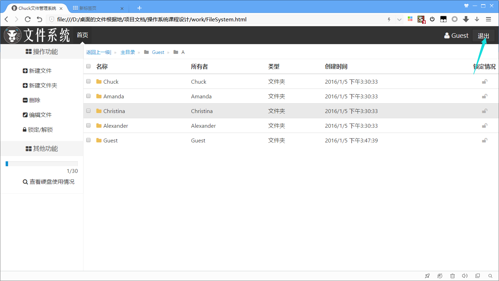

图32 退出操作

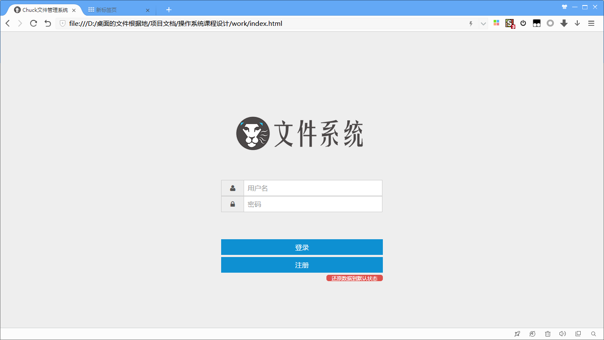

图33 退出操作结果

1.  安装和使用说明

    1.  **安装说明**：

        1.  先按照本报告配置搭建好环境

        2.  将所有文件放入APACHE的htdocs文件夹中

        3.  建立MYSQL本地数据库，账号ROOT，密码ROOT，建立数据库file_system,导入目录下的sql文件

        4.  打开index.html,开始使用
